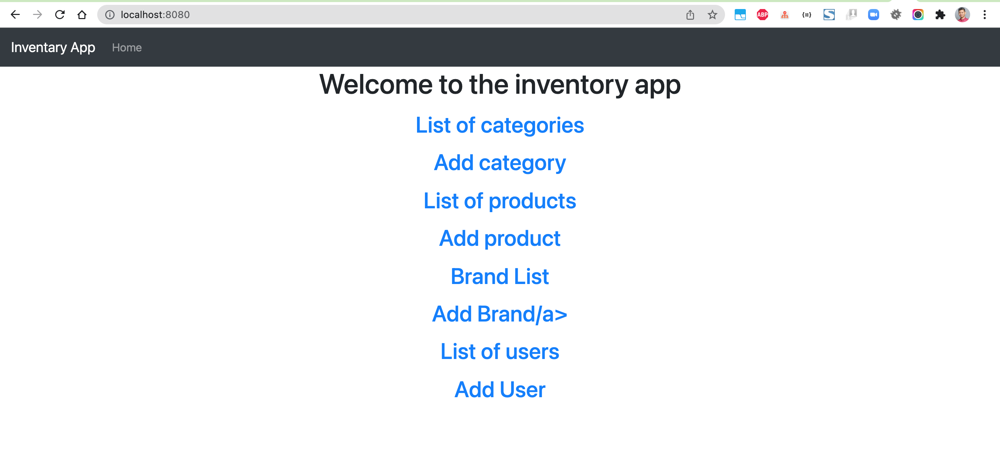
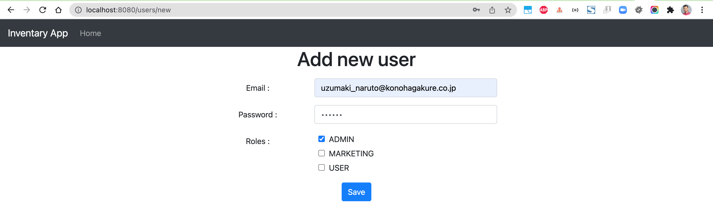
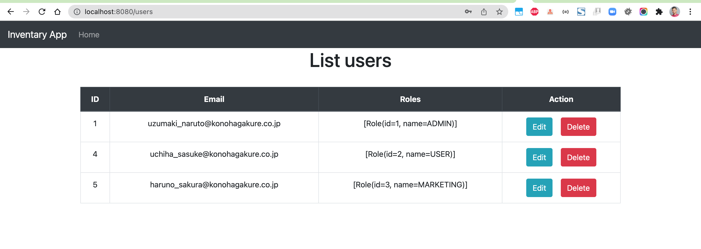
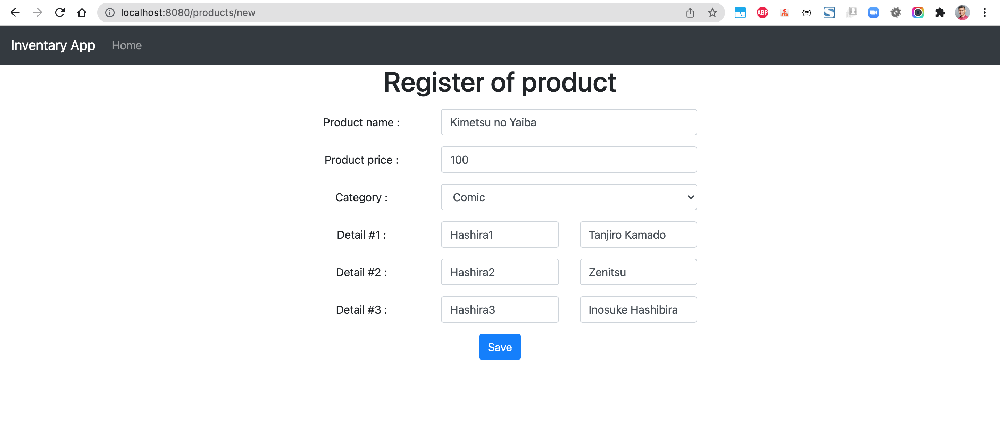
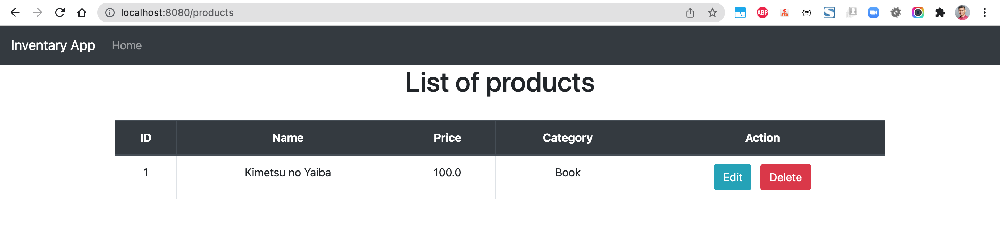
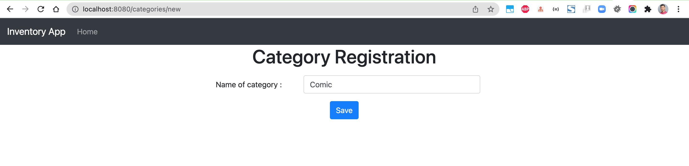
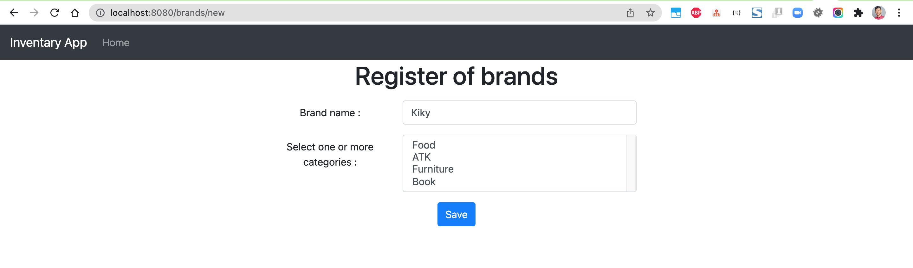

# spring-boot-inventory

### Things todo list:

1. Clone this repository: `git clone https://github.com/hendisantika/spring-boot-inventory.git`
2. Navigate to the folder: `cd spring-boot-inventory`
3. Make sure your DB is running.
4. Run the application: `mvn clean spring-boot:run`
5. Open your favorite browser: `http://localhost:8080`

### Images Screen shot

Home Page

Add New User

List of Users

Add New Product

List of Product

Add New Category

Add New Brand

